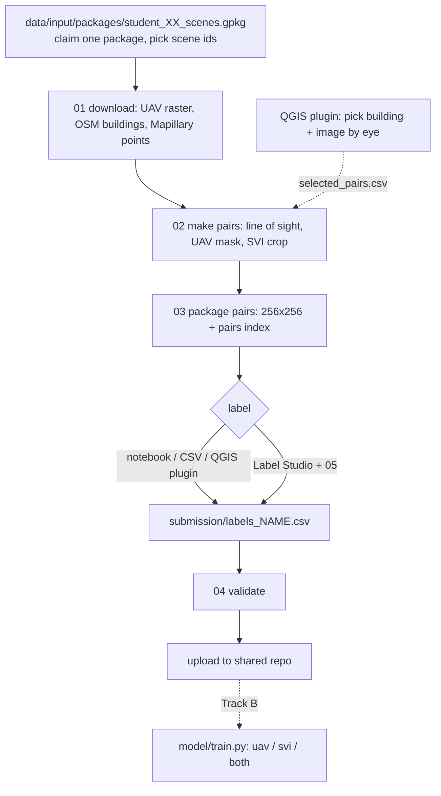

# UAV-SVI Building Annotation (student branch)

You label buildings from two views of the same building: a **UAV (drone) top view** and a **street-level (SVI) view**. Each pair belongs to one specific OSM building. Choosing good buildings, and checking that both images really show the same one, is your job.



## Folders

```
data/input/packages/     the 10 scene packages (given)
data/intermediate/       downloaded rasters, OSM buildings, Mapillary points, panoramas (not uploaded)
data/selected_scenes.gpkg       written by 01
data/output_pairs/       raw chips from 02
submission/              what you upload: uav/, svi/, labels_NAME.csv, pairs_index_NAME.csv
scripts/                 numbered pipeline steps
notebooks/               student_workflow.ipynb (same steps, interactive)
releases/                QGIS plugin zip
```

## 1. Setup

```bash
git clone -b student <this repo>
cd UAV-SVI-Annotation-Pipeline
pip install -r requirements.txt
```

Copy `.env.example` to `.env` and put your free Mapillary token in it (steps 01 and 02 need it). Never commit `.env`.

## 2. Create the image pairs

Take **one** package and write your name next to its number in the shared Google Sheet. Open `data/input/packages/student_XX_scenes.gpkg` in QGIS or in the notebook to see its scenes (country, resolution, area, number of buildings with a valid camera line of sight) and pick scene ids.

```bash
python scripts/01_download.py --scene-ids 5ae3ac2d0b093000130aff91 [ID2 ...]
python scripts/02_make_pairs.py --limit 40 --pano-only   # first run: 40 pairs from 360 panoramas; drop --limit for all valid buildings
python scripts/03_package_pairs.py --name yourname
```

What happens:

- **01** asks the OpenAerialMap API for each scene (the `uuid` field is the GeoTIFF link) and downloads the raster (60 MB to 2 GB, once; downloads show a progress bar), the OSM buildings (ways and multipolygon relations, relation ids written `r<id>`, footprints under 15 m² or over 20,000 m² dropped) and the Mapillary image points. Everything is cached, so re-runs are fast. `--package student_02_scenes.gpkg` takes every scene of a package; `--skip-raster`, `--skip-buildings`, `--skip-svi` skip parts.
- **02** keeps buildings that fit inside a raster and have a valid line of sight to a Mapillary camera within 30 m (non-panorama images must face the building within 50 degrees; `--pano-only` skips ordinary photos, so run with it first and without it later to add more). The UAV chip is the raster cropped around that building and masked to its footprint. The SVI chip is the half of the panorama that faces the building (from the camera compass angle); ordinary photos are used whole. By default it uses **all** valid buildings of the selected scenes. Narrow it with `--osm-ids ...`, `--osm-ids-csv file.csv` (a column `osm_id`, e.g. exported from QGIS), `--scene-ids`, or `--limit`. To force an image you picked yourself add `--manual-pairs submission/selected_pairs.csv` (`--only-manual` for only those buildings).
- **03** writes the upload format into `submission/`: `uav/<osm_id>.png` and `svi/<osm_id>.png` (256x256, never stretched), an empty `labels_yourname.csv`, and `pairs_index_yourname.csv` (which Mapillary image and scene each `osm_id` came from).
- Optional: `python scripts/00f_merge_overlaps.py --scene-ids ID1 ID2` mosaics overlapping scenes that are already in `data/selected_scenes.gpkg` so buildings on a scene border are fully covered (do not re-run 01 afterwards, it rewrites that list).

Open a few pairs and delete the ones where you cannot tell it is the same building in both views (remove both PNGs and the CSV row). The notebook has a cell that shows them.

The notebook `notebooks/student_workflow.ipynb` runs the same steps with the parameters in one cell and shows progress bars.

## 3. Explore and pick pairs in QGIS (optional)

Install `releases/MapillaryClickPreview.zip`: QGIS > Plugins > Manage and Install Plugins > Install from ZIP (QGIS 4.0 or newer). Set your token under Plugins > Mapillary > Mapillary Token. Load your package `.gpkg` and the buildings of your scenes from `data/intermediate/buildings/` (so building ids match the pipeline ids).

- **Explore tab**: display UAV, SVI and buildings; preview a Mapillary image with its building highlighted. If you are sure it is the right building, write the matching cues in the notes box and press **Log previewed building + image as pair**. This appends to `submission/selected_pairs.csv`, which step 02 can use via `--manual-pairs`.
- **Label tab**: choose your `submission` folder, page through pairs, set the five labels, Save and next. Writes the same `labels_yourname.csv`; never edits GeoPackages.

The plugin only reads and writes files in `submission/`, so you can mix it with scripts and notebook at any time.

## 4. Label

Write labels into `submission/labels_yourname.csv`. Allowed values:

| column | values | judged from |
|---|---|---|
| `osm_id` | pre-filled | |
| `mapillary_id` | pre-filled (street view image) | |
| `structural_openness` | `closed_structure`, `open_structure`, `unknown` | UAV |
| `number_of_floors` | `one`, `two`, `three`, `four_or_more`, `unknown` | SVI |
| `vegetation` | `yes`, `no` | UAV |
| `material_rooftop` | `metal`, `concrete`, `asbestos`, `brick`, `wood`, `unknown` | UAV |
| `material_wall` | `metal`, `concrete`, `clay`, `tarpaulin`, `wood`, `unknown` | SVI |

Use `unknown` rather than guessing. Example: [labeling_schemas/example_labels.csv](labeling_schemas/example_labels.csv). Ways to label:

- **Notebook widget** (labelling cell) or **QGIS Label tab**.
- **Spreadsheet/CSV**: edit directly; keep `osm_id` as text.
- **Label Studio**:
  1. `pip install label-studio`; set `LOCAL_FILES_SERVING_ENABLED=true` and `LOCAL_FILES_DOCUMENT_ROOT=<repo>/submission`; start `label-studio`.
  2. Create a project and paste [labeling_schemas/label_studio_schema.xml](labeling_schemas/label_studio_schema.xml) as the labeling config.
  3. Add a Local Files storage pointing at `submission`, run `python scripts/05_labelstudio.py tasks` and import `submission/labelstudio_tasks.json`.
  4. After labelling, export JSON and run `python scripts/05_labelstudio.py export --name yourname --export export.json`.

## 5. Validate and upload

```bash
python scripts/04_validate_submission.py --name yourname
```

Fix every reported problem, then add to the **shared repo**:

```
uav/<osm_id>.png
svi/<osm_id>.png
labels/labels_yourname.csv
pairs/pairs_index_yourname.csv
```

Images carry only the `osm_id`; the CSV file names tell us who produced them and the pairs index tells us which Mapillary image each building was paired with.

## Training on Google Colab (GPU)

`notebooks/colab_training.ipynb` trains the Coupled-ViT single-input classifier of the [Assessing-Building-Heat-Resilience repository](https://github.com/RKsGIS/Assessing-Building-Heat-Resilience-Using-UAV-and-Street-Imagery-with-Coupled-Vision-Transformers) on the collected pairs. Put the shared dataset on Drive as `CV_dataset/` (`uav/`, `svi/`, `labels/labels_<name>.csv`). The notebook mounts Drive, clones both repositories, converts the pairs and labels with `model/prepare_training_data.py` (into `output/labels_data/<uav|svi>/<task>/<class>/<osm_id>.png` and `output/CV_classdata.csv`, as that training script expects) and runs for example:

```bash
python training/train_classifier_single_input.py --task vegetation --input_type svi --backbone Tiny --epochs 100 --batch_size 8 --k_folds 5 --test_size 0.15
```

Tasks are the five label columns; `unknown` and empty labels are skipped. The conversion has a `--pano-only` option (default in the notebook) to train on 360 panoramas first.

## Track B: models (local, PyTorch)

```bash
pip install -r requirements-model.txt
python model/train.py --name yourname --target material_rooftop --view uav    # single view
python model/train.py --name yourname --target material_wall --view svi
python model/train.py --name yourname --target material_wall --view both      # cross-view fusion
```

Fine-tunes a ResNet-18 and prints validation accuracy next to the majority-class baseline. The split is random; if your buildings sit close together, say so when you report results.

## Attribution

OpenAerialMap imagery (check each scene's licence), Mapillary imagery (CC BY-SA 4.0; never try to undo blurring), OpenStreetMap contributors (ODbL). QGIS plugin based on [MapillaryClickPreview](https://github.com/annadeckmyn/MapillaryClickPreview/).

## Organiser scripts (not needed by students)

`scripts/00a`-`00d` build the catalog (OAM catalog, Mapillary/OSM filtering, line-of-sight scoring, claim sheet) into `data/catalog/`. They need a Mapillary token and take hours.
