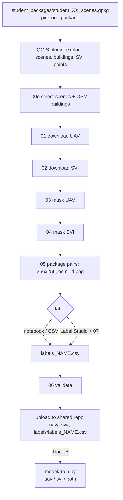

# UAV-SVI Building Annotation (student branch)

You label buildings from two views of the same building: a **UAV (drone) top view** and a **street-level (SVI) view**. This branch contains everything you need. The scene catalog was built by the organiser (scripts `00a`-`00d`, see the end of this file).



## 1. Setup

```bash
git clone -b student <this repo>
cd UAV-SVI-Annotation-Pipeline
pip install -r requirements.txt
```

Create `.env` in the repository root (needed for step 02, free token from the Mapillary developer dashboard):

```env
MAPILLARY_ACCESS_TOKEN=MLY|...
```

Never commit `.env`.

## 2. Choose a scene package

`student_packages/` holds 10 GeoPackages (about 7,300 labelable pairs in total, Global South scenes first). Take **one**, write your name next to its number in the shared Google Sheet so nobody labels the same package, then look inside:

```bash
python scripts/00e_prepare_selection.py --package student_packages/student_03_scenes.gpkg --list
```

If scenes overlap, you can crop from the overlapping area yourself (merge the rasters) or simply choose non-overlapping scene IDs.

## 3. Explore in QGIS (optional)

Install the plugin from `releases/MapillaryClickPreview.zip`: QGIS > Plugins > Manage and Install Plugins > **Install from ZIP**. It needs QGIS 4.0 or newer. Set your token under Plugins > Mapillary > Mapillary Token. Open your package `.gpkg` in QGIS to see the scene footprints and load `data/input/osm_buildings.gpkg` (from step 4) so that building ids match your pipeline ids.

The plugin has two tabs:

- **Explore**: display UAV, SVI and buildings, preview a Mapillary image with its building highlighted. If you are sure the highlighted building is the one in the image, add matching cues in the notes box and press **Log previewed building + image as pair**. This appends `osm_id, mapillary_id, distance, compass, notes` to `submission/selected_pairs.csv`.
- **Label**: choose your `submission` folder, page through the pairs, set the five labels and press Save and next. It writes the same `labels_<name>.csv` as the scripts and never edits GeoPackages. "Zoom to building" jumps to the building in QGIS.

The plugin is optional: it only reads and writes files in `submission/`, so you can mix it with the scripts and the notebook at any point.

## 4. Create the image pairs

```bash
python scripts/00e_prepare_selection.py --package student_packages/student_03_scenes.gpkg --scene-ids ID1 ID2   # omit --scene-ids for all
python scripts/01_download_uav.py
python scripts/02_download_svi.py
python scripts/03_mask_uav.py
python scripts/04_mask_svi.py
python scripts/05_package_pairs.py --name yourname
```

Raw outputs land in `data/output_pairs/`. Every pair belongs to one specific OSM building: the UAV chip is cropped and masked to that building's footprint, the SVI chip is cut around the direction from the camera to that building. Finding good buildings is your job, so look at the pairs before labelling (the notebook shows them).

- OSM buildings include ways and multipolygon relations. Relation ids are written as `r<id>` so they never collide with way ids.
- `pairs_index_yourname.csv` (from step 05) records which Mapillary image and scene each `osm_id` came from, so nothing depends on file names.
- Automatic SVI matching is only a suggestion. To force the image you picked in QGIS, add `--manual-pairs submission/selected_pairs.csv` (and `--only-manual` to build pairs only for those buildings) to step 02.
- Optional: `python scripts/00f_merge_overlaps.py --scene-ids ID1 ID2` mosaics overlapping scenes so buildings on a scene border are fully covered; `--buildings a.gpkg b.gpkg` merges building files without duplicate `osm_id`.

Step 05 produces the upload format in `submission/`:

```
submission/uav/<osm_id>.png        256x256
submission/svi/<osm_id>.png        256x256
submission/labels_yourname.csv     one row per osm_id, label columns empty
submission/pairs_index_yourname.csv
```

The same steps run in `notebooks/student_workflow.ipynb` (load package, choose scenes, tweak parameters, build pairs, look at them, label).

## 5. Label

Write your labels into `submission/labels_yourname.csv`. Allowed values:

| column | values | judged from |
|---|---|---|
| `osm_id` | pre-filled | |
| `structural_openness` | `closed_structure`, `open_structure`, `unknown` | UAV |
| `number_of_floors` | `one`, `two`, `three_or_more`, `unknown` | SVI |
| `vegetation` | `yes`, `no` | UAV |
| `material_rooftop` | `concrete`, `metal`, `tile`, `asbestos`, `thatch_wood`, `other`, `unknown` | UAV |
| `material_wall` | `concrete`, `brick`, `metal`, `wood`, `glass`, `other`, `unknown` | SVI |

Use `unknown` rather than guessing. Example: [labeling_schemas/example_labels.csv](labeling_schemas/example_labels.csv).

Choose one way to label:

- **Notebook widget**: the labelling cell in `notebooks/student_workflow.ipynb`.
- **Spreadsheet/CSV**: edit the CSV directly. Keep `osm_id` as text (do not let Excel convert it).
- **Label Studio**:
  1. `pip install label-studio`, then set `LOCAL_FILES_SERVING_ENABLED=true` and `LOCAL_FILES_DOCUMENT_ROOT=<repo>/submission`, and start `label-studio`.
  2. Create a project, paste [labeling_schemas/label_studio_schema.xml](labeling_schemas/label_studio_schema.xml) as the labeling config.
  3. Add a Local Files storage pointing at `submission`, then `python scripts/07_labelstudio.py tasks` and import `submission/labelstudio_tasks.json`.
  4. After labelling, export as JSON and run `python scripts/07_labelstudio.py export --name yourname --export export.json`.

## 6. Validate and upload

```bash
python scripts/06_validate_submission.py --name yourname
```

Fix every reported problem, then add to the **shared repo**:

```
uav/<osm_id>.png
svi/<osm_id>.png
labels/labels_yourname.csv
pairs/pairs_index_yourname.csv
```

Image files carry only the `osm_id`; the CSV file names tell us who produced them and the pairs index tells us which Mapillary image each building was paired with. Every `osm_id` in your CSV must have an image in both folders.

## Track B: models

```bash
pip install -r requirements-model.txt
python model/train.py --name yourname --target material_rooftop --view uav    # single view
python model/train.py --name yourname --target material_wall --view svi
python model/train.py --name yourname --target material_wall --view both      # cross-view fusion
```

It fine-tunes a ResNet-18 and prints validation accuracy next to the majority-class baseline. The split is random; if your buildings sit close together, say so when you report results.

## Attribution

OpenAerialMap imagery (check each scene licence in `student_packages`), Mapillary imagery (CC BY-SA 4.0, never try to undo blurring), OpenStreetMap contributors (ODbL). QGIS plugin based on [MapillaryClickPreview](https://github.com/annadeckmyn/MapillaryClickPreview/).

## Organiser scripts (not needed by students)

`scripts/00a`-`00d` build the catalog and the 10 packages: OAM catalog, Mapillary/OSM filtering, line-of-sight scoring, claim sheet. They need a Mapillary token in `.env` and take hours.
