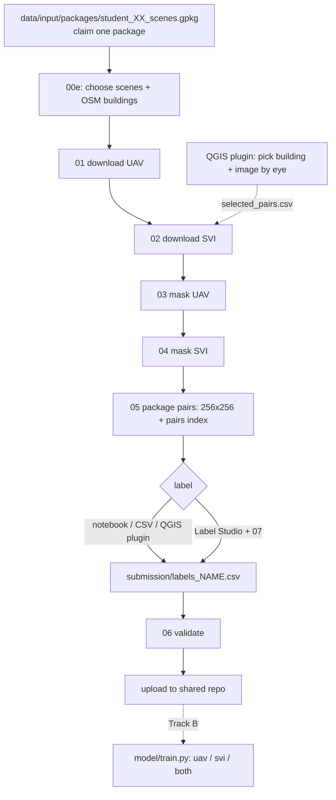

# UAV-SVI Building Annotation (student branch)

You label buildings from two views of the same building: a **UAV (drone) top view** and a **street-level (SVI) view**. Each pair belongs to one specific OSM building. Choosing good buildings, and checking that both images really show the same one, is your job.



## Folders

```
data/input/packages/     the 10 scene packages (given)
data/input/osm_buildings.gpkg   written by 00e
data/selected_scenes.gpkg       written by 00e
data/intermediate/       downloaded rasters, panoramas, chips (not uploaded)
data/output_pairs/       raw chips from 03 / 04
submission/              what you upload: uav/, svi/, labels_NAME.csv, pairs_index_NAME.csv
scripts/                 numbered pipeline steps
notebooks/               student_workflow.ipynb (same steps, interactive)
releases/                QGIS plugin zip
```

## 1. Setup

```bash
git clone -b student <this repo>
cd UAV-SVI-Annotation-Pipeline
pip install -r requirements.txt
```

Copy `.env.example` to `.env` and put your free Mapillary token in it (step 02 needs it). Never commit `.env`.

## 2. Create the image pairs

Take **one** package, write your name next to its number in the shared Google Sheet, then look inside:

```bash
python scripts/00e_prepare_selection.py --package student_01_scenes.gpkg --list
```

Pick scene IDs (`--list` shows country, resolution, area and how many camera/building matches each scene has) and run the steps. Do a first run with `--limit 40`: every selected building costs a panorama download in step 02.

```bash
python scripts/00e_prepare_selection.py --package student_01_scenes.gpkg --scene-ids ID1 ID2
python scripts/01_download_uav.py --limit 40      # downloads the scene rasters (60 MB - 2 GB each, once)
python scripts/02_download_svi.py
python scripts/03_mask_uav.py
python scripts/04_mask_svi.py
python scripts/05_package_pairs.py --name yourname
```

Remove `--limit` (or use `--osm-ids ...`) once you are happy.

What happens:

- **00e** downloads OSM buildings (ways and multipolygon relations; relation ids are written `r<id>` so they never collide with way ids) and drops footprints under 15 m² or over 20,000 m².
- **01** assigns each building to a UAV scene that fully covers it. If a scene border cuts through buildings you want, `python scripts/00f_merge_overlaps.py --scene-ids ID1 ID2` mosaics those scenes first (optional; `--buildings a.gpkg b.gpkg` merges building files without duplicate `osm_id`).
- **02** finds a Mapillary image near each building with a clear line of sight. This is only a suggestion; to force an image you picked yourself add `--manual-pairs submission/selected_pairs.csv` (plus `--only-manual` for only those buildings).
- **03** crops the UAV raster around the building and blacks out everything outside its footprint. **04** cuts the panorama around the viewing direction towards the building.
- **05** writes the upload format into `submission/`: `uav/<osm_id>.png` and `svi/<osm_id>.png` (256x256, never stretched), an empty `labels_yourname.csv`, and `pairs_index_yourname.csv` (which Mapillary image and scene each `osm_id` came from).

Open a few pairs and delete the ones where you cannot tell it is the same building in both views (remove both PNGs and the CSV row). The notebook has a cell that shows them.

The notebook `notebooks/student_workflow.ipynb` runs the same steps with the parameters (search radius, padding, SVI window width, focus ratio) in one cell.

## 3. Explore and pick pairs in QGIS (optional)

Install `releases/MapillaryClickPreview.zip`: QGIS > Plugins > Manage and Install Plugins > Install from ZIP (QGIS 4.0 or newer). Set your token under Plugins > Mapillary > Mapillary Token. Load your package `.gpkg` and `data/input/osm_buildings.gpkg` (so building ids match the pipeline ids).

- **Explore tab**: display UAV, SVI and buildings; preview a Mapillary image with its building highlighted. If you are sure it is the right building, write the matching cues in the notes box and press **Log previewed building + image as pair**. This appends to `submission/selected_pairs.csv`, which step 02 can use via `--manual-pairs`.
- **Label tab**: choose your `submission` folder, page through pairs, set the five labels, Save and next. Writes the same `labels_yourname.csv`; never edits GeoPackages.

The plugin only reads and writes files in `submission/`, so you can mix it with scripts and notebook at any time.

## 4. Label

Write labels into `submission/labels_yourname.csv`. Allowed values:

| column | values | judged from |
|---|---|---|
| `osm_id` | pre-filled | |
| `structural_openness` | `closed_structure`, `open_structure`, `unknown` | UAV |
| `number_of_floors` | `one`, `two`, `three_or_more`, `unknown` | SVI |
| `vegetation` | `yes`, `no` | UAV |
| `material_rooftop` | `concrete`, `metal`, `tile`, `asbestos`, `thatch_wood`, `other`, `unknown` | UAV |
| `material_wall` | `concrete`, `brick`, `metal`, `wood`, `glass`, `other`, `unknown` | SVI |

Use `unknown` rather than guessing. Example: [labeling_schemas/example_labels.csv](labeling_schemas/example_labels.csv). Ways to label:

- **Notebook widget** (labelling cell) or **QGIS Label tab**.
- **Spreadsheet/CSV**: edit directly; keep `osm_id` as text.
- **Label Studio**:
  1. `pip install label-studio`; set `LOCAL_FILES_SERVING_ENABLED=true` and `LOCAL_FILES_DOCUMENT_ROOT=<repo>/submission`; start `label-studio`.
  2. Create a project and paste [labeling_schemas/label_studio_schema.xml](labeling_schemas/label_studio_schema.xml) as the labeling config.
  3. Add a Local Files storage pointing at `submission`, run `python scripts/07_labelstudio.py tasks` and import `submission/labelstudio_tasks.json`.
  4. After labelling, export JSON and run `python scripts/07_labelstudio.py export --name yourname --export export.json`.

## 5. Validate and upload

```bash
python scripts/06_validate_submission.py --name yourname
```

Fix every reported problem, then add to the **shared repo**:

```
uav/<osm_id>.png
svi/<osm_id>.png
labels/labels_yourname.csv
pairs/pairs_index_yourname.csv
```

Images carry only the `osm_id`; the CSV file names tell us who produced them and the pairs index tells us which Mapillary image each building was paired with.

## Track B: models

```bash
pip install -r requirements-model.txt
python model/train.py --name yourname --target material_rooftop --view uav    # single view
python model/train.py --name yourname --target material_wall --view svi
python model/train.py --name yourname --target material_wall --view both      # cross-view fusion
```

Fine-tunes a ResNet-18 and prints validation accuracy next to the majority-class baseline. The split is random; if your buildings sit close together, say so when you report results.

## Attribution

OpenAerialMap imagery (check each scene's licence), Mapillary imagery (CC BY-SA 4.0; never try to undo blurring), OpenStreetMap contributors (ODbL). QGIS plugin based on [MapillaryClickPreview](https://github.com/annadeckmyn/MapillaryClickPreview/).

## Organiser scripts (not needed by students)

`scripts/00a`-`00d` build the catalog (OAM catalog, Mapillary/OSM filtering, line-of-sight scoring, claim sheet) into `data/catalog/`. They need a Mapillary token and take hours.
